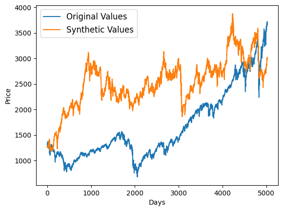
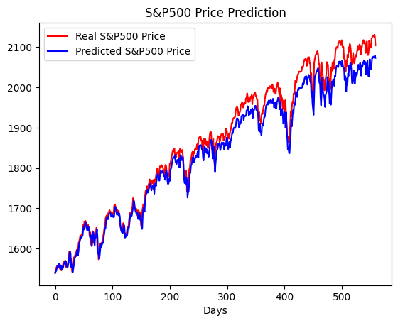
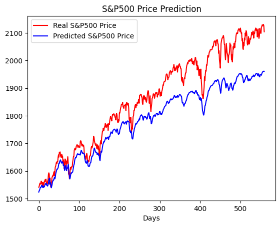

# Synthetic Time Series

We use GANs to generate synthetic time series of S&P500 returns. Then we train a LSTM model on the synthetic returns to see whether it performs better than a LSTM model trained on real returns.

# Results

## Time Series Generated

We have generated a realistic time series!

## Time Series Prediction With LSTMs

### LSTM Trained On Synthetic Returns

The root mean squared error is 31.5.

### LSTM Trained On Real Returns

The root mean squared error is 92.2.

## Conclusion

We achieved a 3x lower RMSE by training a LSTM model on our synthetic data than on real data!
